# <h1>Final Project Documentation
### <h3> Online Job Portal
#####<h5> Prepared By: Niya Anil, Toral Panasuria, Bhoomi Patel

####<h4> INTRODUCTION
  
  Perceiving a job that suits the skill set is always a predicament. Similarly, finding the suitable candidate for a particulr position is also difficult for an employer. This projects aims to build a online job portal that suits the needs of both employer and seeker.
  
  This project has three modules - employer, seeker and admin. Job seekers from any background can search for job. For any user to apply for a valid job, they need to register for the job. Job seekers can edit their profile, view the jobs , upload the resume. Employers can also register to the site and get the details of the applicants who aplliedfor their job postings. Moreover employer can activate and deactivate the job postings. Admin can view the details of the both employers and job seekers who registerd to the site. He can update the constant tables such as Job Skills, Skill level which needed to be used by the employer or job seekers. He can send reply mail to any person whi send mail for any issues. None of the user need to be registered inorder to send query. 
  
  ####<h4> Targeted audience and objective
  
  With this web application we aim to target users who are looking for job like – newly graduates, experienced intern at other organization looking for better opportunity, part time worker, looking for job at particular industry and employers -looking for employees having skills that they required for the position.

####<h4> Requirement Specifications
  
  #####<h5> Software Requirement
  ######<h6> 
   * Operating System: Windows 10
   * IDE: PHP WebStorm
   * Programming Language : PHP
   * Front End: HTML, CSS, JavaScript, JQuery
   * Model: Watefall Model
   * Database: MySQL
  
  #####<h5> Hardware Requirement
  ######<h6>
   * Processor: Intel core i7
   * Processor speed: 3.40 GHz
   * RAM: 8 GB
  
####<h4> List of Features
  
  #####<h5> ADMIN FEATURES  (by Niya Anil)
  
  * View jobseeker and employer information.
  * Admin can send reply mail to any query send by anyone through site.
  * View, Edit, Delete, Update skill set, skill level, business stream etc.
  * Admin can view the graph of how many employers, job seekeres are registered.
  * Admin can view the graph of how many applicants has applied for the job and how many job posted by an employer
  
  | Role  | Feature                                                                                                        | File                                                                                                  | js             |
|-------|----------------------------------------------------------------------------------------------------------------|-------------------------------------------------------------------------------------------------------|----------------|
| Admin | View jobseeker and employer information                                                                        | AdminEmployerDetails.php AdminSeeker.php seeker.php employer.php                                      | userdetails.js |
| Admin | Admin can send reply mail to any query send by anyone through site                                             | inbox.js receivedmail.php                                                                            | inbox.php      |
| Admin |  View,Edit,Delete,Update skillset, skill level, businessstream etc.                                            | uielements.php loaduielements.php deleteuielements.php addelementsuielements.php updateuielements.php | uielements.js  |
| Admin | Admin can view the graph of how many employers, job seekeres are registered.                                   | dashboard_admin.php                                                                                   | N/A            |
| Admin | Admin can view the graph of how many applicants has applied for the job and how many job posted by an employer | dashboard_admin.php                                                                                   | N/A            |
  
  
#####<h5> JOB SEEKER FEATURE  (by Bhoomi Patel)
  
  * Seeker can register for the online site.
  * View and apply for the job.
  * Send mail
  * Seeker can upload the resume
  
 
 | Role       | Feature                                                                                       | Files                                                                                                                 |
|------------|-----------------------------------------------------------------------------------------------|-----------------------------------------------------------------------------------------------------------------------|
| Job Seeker | Login and Signup                                                                              | login.php,  registration.php,  JobSeekerProfile.php                                                                   |
| Job Seeker | Job Seeker can apply to available jobs with resume and get the mail regarding job application | home.php,  jobSeekerHome.php,  mainPageJob.php,  jobdescription.php,  JobSeekerJobApplication.php,  jobseekermail.php |
| Job Seeker | View and update their profile                                                                 | userprofile.php,  JobSeekerProfile.php                                                                                |
| Job Seeker | View list of Applied jobs                                                                     | appliedjobs.php                                                                                                       |
 
  
  #####<h5> EMPLOYER FEATURE  (by Toral Panasuria)
  
  * Employers can register to the page.
  * Add and delete the job posting.
  * Can add the company details.
  * View the applicants applied for the job.
  
  | Role     | Feature                                                                                                                                                                              | File                                       |
|----------|--------------------------------------------------------------------------------------------------------------------------------------------------------------------------------------|--------------------------------------------|
| Employer | Employer Login and Signup                                                                                                                                                            | EmployerLogin.php                          |
| Employer | Employer can view and update their profile  Employer can add company detail                                                                                                          | EmployerProfile.php                        |
| Employer | Employer can view company detail they added on profile page Employer can post the job                                                                                                | jobpost.php                                |
| Employer | Employer can view the job list they posted with all the job post detail Employer can edit the that job  Employer can disable job and make that job no longer available for employees | EmployerJobs.php EditJob.php DeleteJob.php |
| Employer | Employer can view the list of employees that applied for that specific job                                                                                                           | ViewJobApplication.php                     |
| Employer | Employer can send the mail to user that applied for job                                                                                                                              | EmployerMail.php                           |
  
   ####<h4> Graphical User Interface 
  
  #####Admin Pages
  
 * Admin Login Page
  
  
  
  * Admin Dashboard
  
  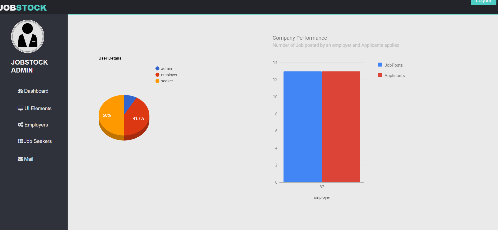
  
  * Admin UIElements
  
  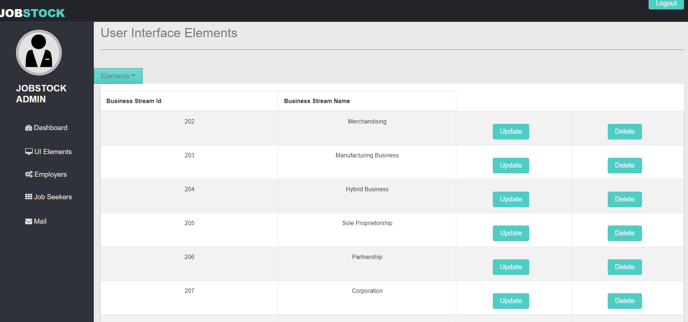
  
  * Admin Compose mail
  
  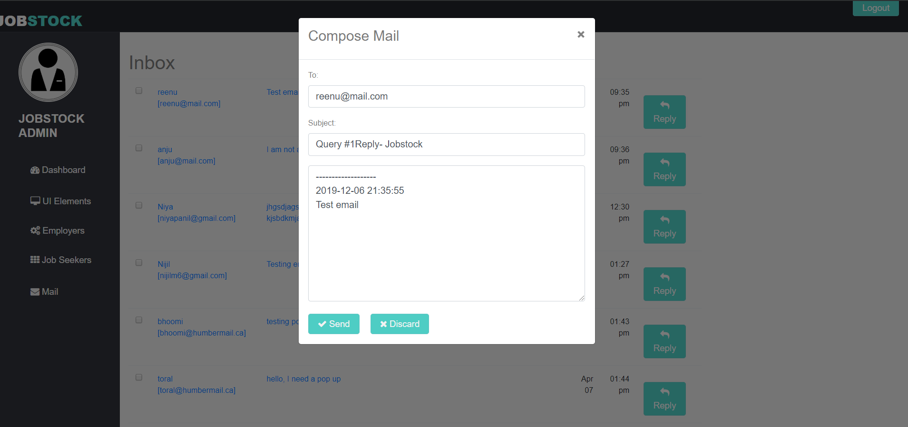
  
   * Admin View Employers
   
   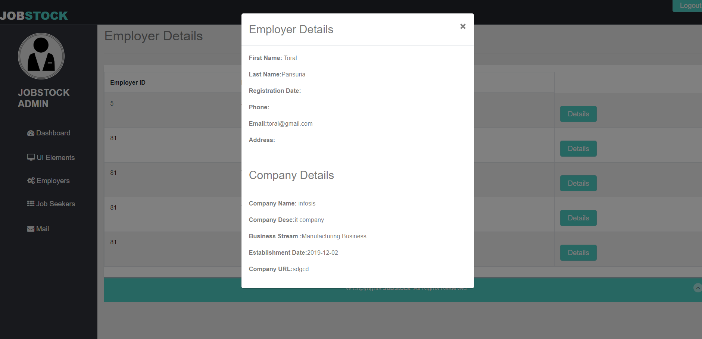
   
   
   
   #####Job Seeker Pages
   
   * Job Seeker Login Page
  
  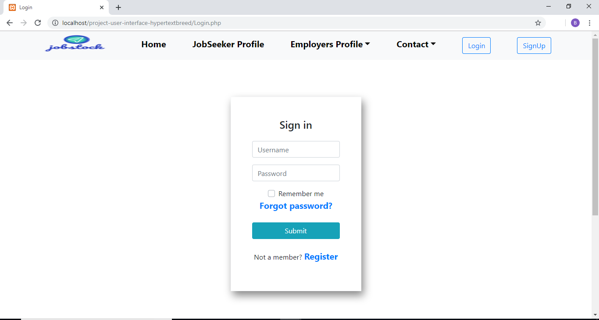
  
  * Job Seeker Signup Page
  
  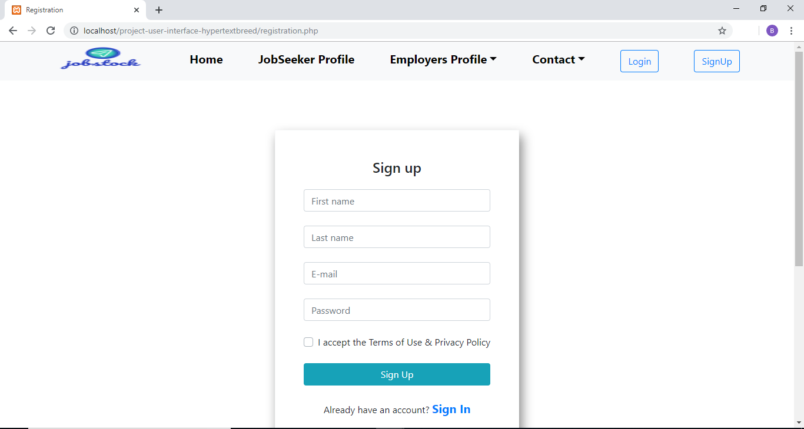
  
  * Job Seeker - List of available jobs
  
  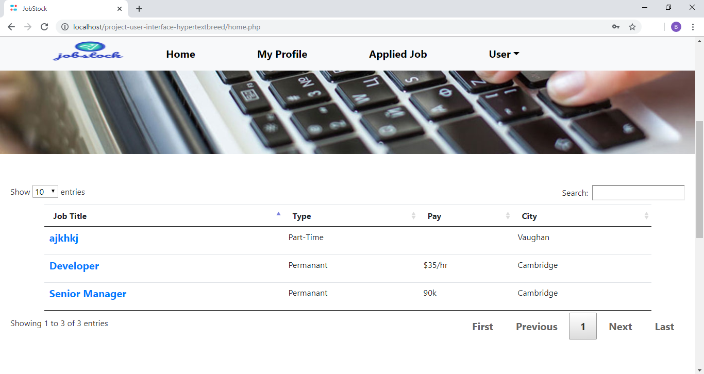
  
  * Job Seeker - Job Description
  
  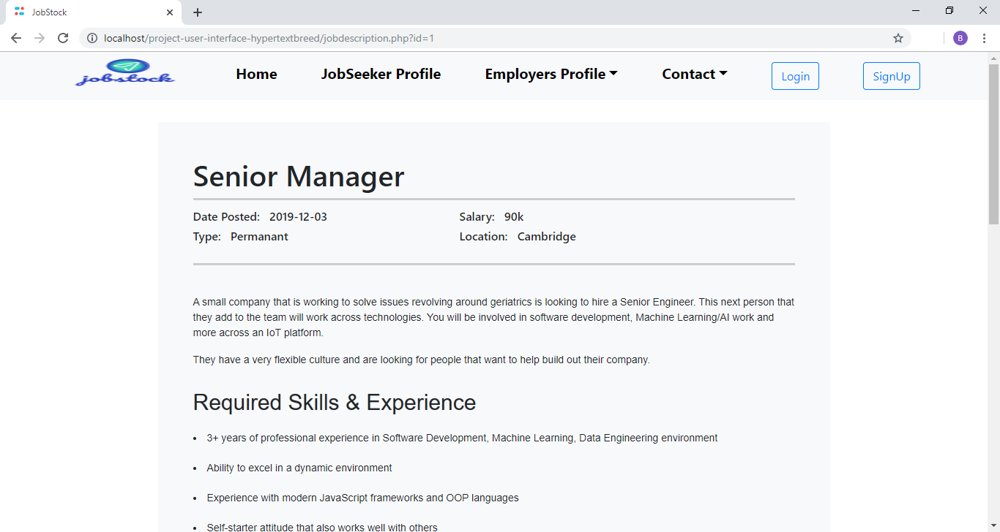
  
  * Job Seeker - Apply Job
  
  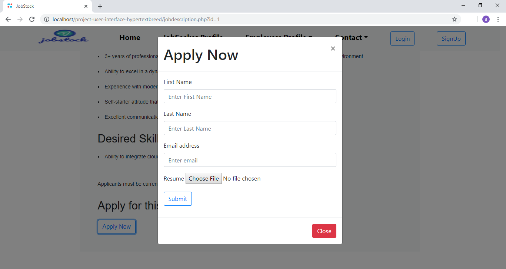
  
  * Job Seeker Profile
  
  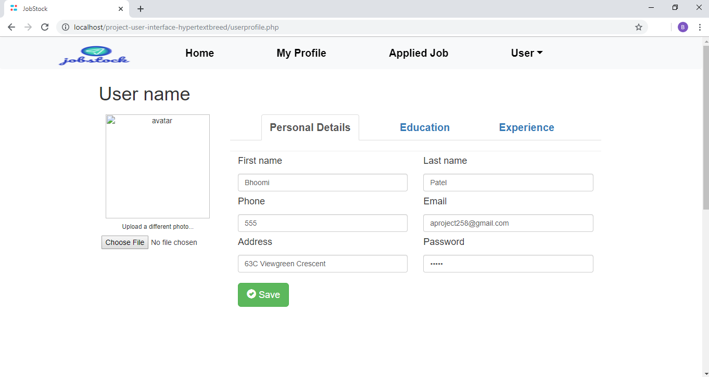
  
   
   
   

  ####<h4> Database Design
  
  The database that is used to design the web application is MySQL. We have used MySQL to store
employer details, jobseeker details, applied jobs by the applicants, jobs posted by the employer, contact us table for any person.
Hence, we have identified below tables to achieve desired functionality.

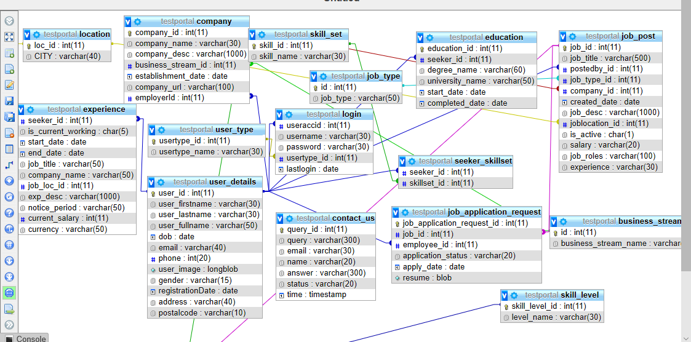 
    
    1. login: Include the details to login the page
    2. user_details: Includes user who registered to the page
    3. user_type: 3 types of user- admin, employer and seeker. It is a constant table
    4. company: Companh information of the employer
    5. education: education details of the seeker
    6. experience: experience of the seeker
    7. job_application_request: details of teh applicant applied for the job
    8. seeker_skillset: skill set for the seeker
    9. job_post: Contain the details of the job posted by the employer
    10. skill_set: static table that contain the skill sets
    11. skill_level: static table that contain the skill level.
    
    

    
    
    
  
     
  
